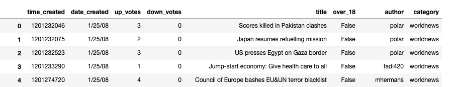
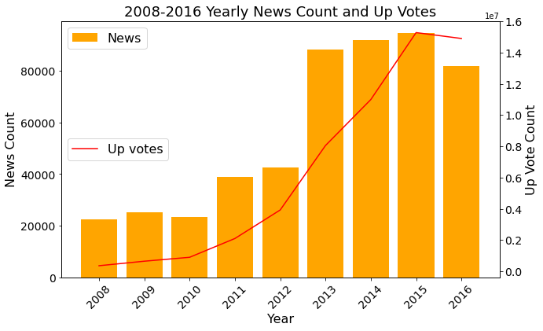
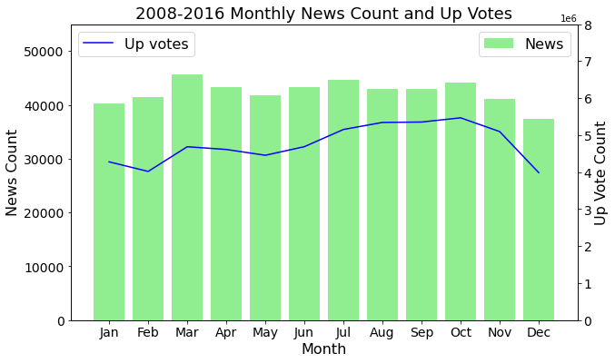
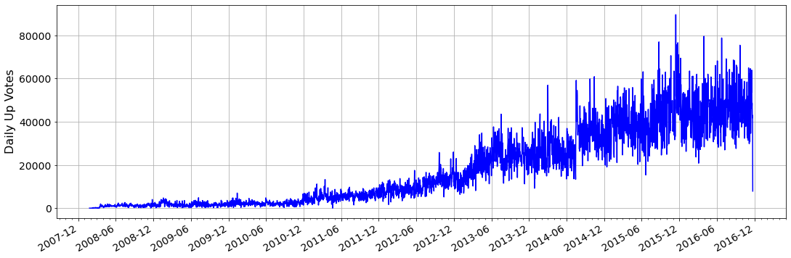
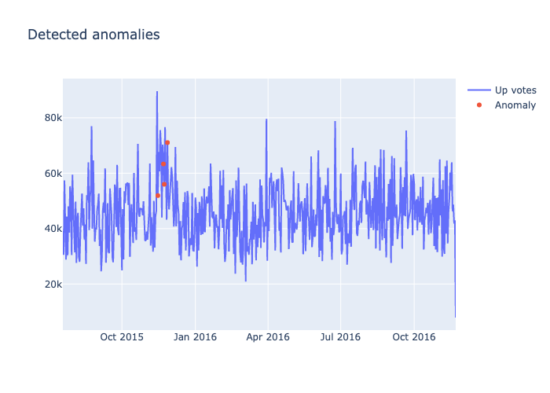
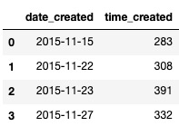
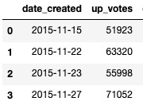
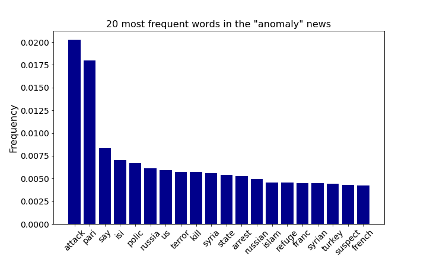

# WorldNews-UpVotes-Anomaly-Detection-LSTM
1. Dataset
  A large dataset (72.7 MB) of time-series news information published on Worldnews between 1/25/2008 and 11/22/2016, a peek on this dataset is shown below: .
 There are 509236 rows and 8 columns which are "time_created", "date_created", "up_votes", "down_votes", "title", "over_18", "author", and "category". Note that in  "down_votes" column, the numbers are all zero and there is only one category which is Worldnews.
 
2. Motivation 
Given such dataset, an overall goal is to find any association between the large number of up votes and the types of news. Such information can serve as a guidence for inserting appropriate adds on the news pages. To do this, we can perform the following tasks step by step. 
* Exploring the yearly, monthly, and daily trends of the number of news and their corresponding up votes. 
* Using Machine Learning (ML) techniques to identify anomalies in the time-series up votes. 
* Perform Natural Language Processing (NLP) techniques on the "anomaly" news to extract the most frequent words in such news  
  
3. Technologies Used

 * Python
    - numpy
    - pandas
    - matplotlib
 * TensorFlow
 * Keras
 * Sklearn
 * NLTK

4. How to run the scripts
* Files
  -  `Eluvio_DS_Challenge.csv`
  -  `WorldNews_Anomaly_Detection_LSTM.ipynb`.
* Make sure the data file and the jupyter notebook in the same folder
* Open `WorldNews_Anomaly_Detection_LSTM.ipynb` and run it 

5. Results
* Yearly trend of the news
There is an overall increase in the yearly number of news from 2008 to 2016 with a peak in 2015, the similar trend was observed in the number of up votes.

.

* Monthly trend of the news
We then investigate the monthly trends and found that March, July, and October had slightly higher number of news and least number of news was observed in December. The up votes showed the similar trend as the number of news in each month.

* Daily trend of the news
The daily up votes had increased dramatically over the course of the 8 years with some daily flucturations. The highest daily up votes is above 80000.

 
 
 We then used the LSTM autoencoder technique to identify 4 anomalies in the time-series daily up votes and the results are shown below:
 
 
 The four anomalies corresponded to dates Nov 15, 22, 23, and 27 in the year of 2015. There are about 300 news with more than 50000 up votes in each of the four days. 
 
 
 
 
 
 
* Most frequent words in the anomalies
Twenty most frequent words in the anomalies were identified and they are "attack", "pari" (paris), "isi" etc. We may conclude that those news are about France launched air strikes on Isis stronghold Raqqa in Syria in wake of terror attack on Paris.

 
 
6. Conclusion
Based on our analysis, both the news number and the up votes are increasing each year probably due to the popularity of the person electronic devices. People can easily access news nowadays. The LSTM and NLP results suggest that terror attack news seemed to attracted most readings and up votes. Implemation adds on such news should be further investigated, including obtain more detailed data of the readers, A/B testing, and some other experiment design and analysis techniques. 
